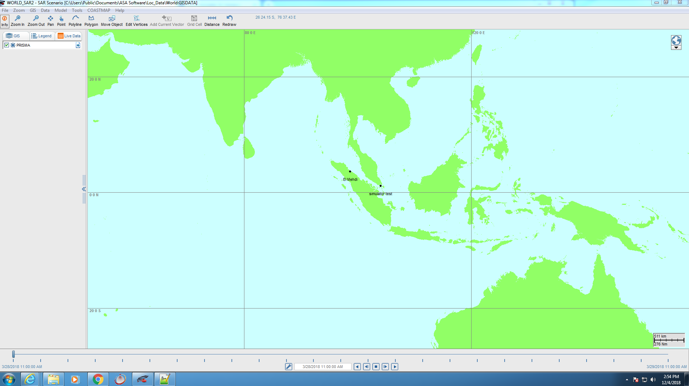

# How To: Check Sarmap integration C2 side

SARMAP is a GIS-based search and rescue model used to predict the path of different floating objects in marine or fresh waters. SARMAP includes the ability to deploy search and rescue units, set their search patterns, and calculate the probability of containment, probability of detection, and probability of success. The SARMAP model may also be run in backtrack mode to determine the potential origin of found objects.

SARMAP integration concists of C2 forwarding tracks associated to open incidents over the REST following end point: `http://server-ip:8081/api/v2/sarmap.json`. To test that C2 server sarmap end point is up, try the REST endpoint in a browser, and the output should look like below, if you get an empty array that means no open incidents in C2 have an associated track into them: 

```json
[
   {
      "type":"Feature",
      "properties":{
         "label":"Incident 47 - MOB",
         "deviceType":"manual"
      },
      "geometry":{
         "type":"Point",
         "coordinates":[
            20.2,
            70.8
         ]
      }
   },
   {
      "type":"Feature",
      "properties":{
         "label":"Incident 112 lost contact",
         "deviceType":"manual"
      },
      "geometry":{
         "type":"Point",
         "coordinates":[
            30.5,
            90.9
         ]
      }
   },
   {
      "type":"Feature",
      "properties":{
         "label":"Incident 234 unknown",
         "deviceType":"manual"
      },
      "geometry":{
         "type":"Point",
         "coordinates":[
            30.5,
            90.9
         ]
      }
   }
]
```


# How To: Check C2 integration SARMAP side

In order for SARMAP to read C2 data, add [live_layers.xml](https://releases.mcmurdo.io/sarmap/Live_Layers.xml) under `C:\Users\Public\Documents\ASA Software\SARMAP\system\` in your local windows machine. 

If the integration work and you have open incidents in C2 with tracks associated to them you should be able to see something similar to the below screenshot on you screen as soon as you check the prisma box under the live data section.



!!! info
    If the integration does not work after the verification of the REST end point is successful, it means, you maybe do not have the SARMAP exe that has the live data integration working. You will need to download the right [sarmap.exe](https://releases.mcmurdo.io/sarmap/sarmap.zip)

