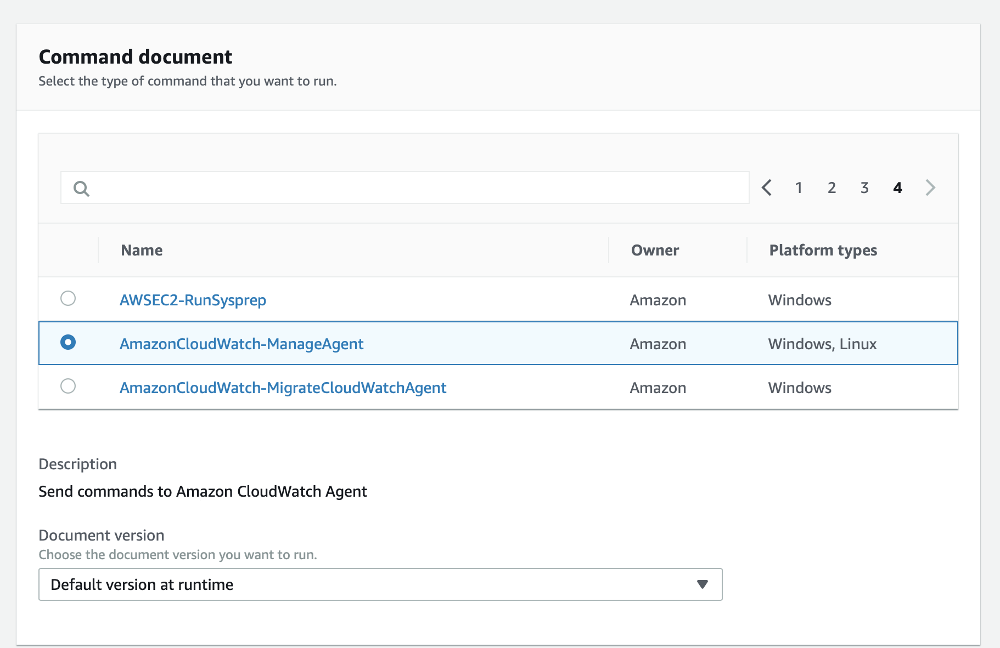

# CloudWatch

## Installing CloudWatch Agent to monitor stats

For every system we want to monitor stats using CloudWatch, we need to install the CloudWatch agent
onto the machine so it can communicate automatically with CloudWatch to send metrics.

Installation is essentially two parts, setting up the IAM role for the instance then running the
command to install CloudWatch.

### Attach CloudWatch Server Agent IAM Role

First, we need to attach the correct IAM Role so that the instance can be configured by the
AWS Systems Manager which is how we install and configure the CloudWatch Agent.

Navigate to EC2 and select the instance you want to get metrics from. Once selected, click the
Actions dropdown at the top then go down to Instance Settings then Attach/Replace IAM Role.


This will bring up a page where you have a single dropdown to select the new IAM Role.
Select or Type `CloudWatchAgentServerRole` and save.


!!! warning
    Now the correct role should be attached to the instance. After adding the role it may take some period of time for the change to propogate across AWS so the next step may not show the instance right away, it make take an hour or so.

[AWS Documentation on installing CloudWatch Agent](https://docs.aws.amazon.com/AmazonCloudWatch/latest/monitoring/Install-CloudWatch-Agent.html)

### Install CloudWatch Agent

Head to AWS Systems Manager (SSM) and in the sidebar click `Run Command`. Then click `Run Command` on the top right of the page.


Now, select `AWS-ConfigureAWSPackage` in the `Command Document` section. Scroll down to the next section `Command Parameters`. The first input should say Install, and the second input is asking for a name. Type `AmazonCloudWatchAgent`.


Scroll down again to Targets and and select your instance from the list. If your instance is not there then one of a few things may have happened:

* IAM role has not propogated from previous step.
* SSM is not installed on the machine


Once instance is selected, scroll to the bottom of the page and click `Run`.


When completed you should see success (you may have to hit the refresh icon to see the status change from pending to success).


## Configuring Cloud Watch Agent

Configuring the cloud watch agent is almost identical to the steps to install, but for the first section `Command Document` go to the last page and select `AmazonCloudWatch-ManageAgent`.



Then in the second section, the `Configure` action should already be selected, and there should be an empty input for `Optional Configuration Location`. For CloudWatch, we have already created a configuration for every system, and its stored in the [ParameterStore](https://console.aws.amazon.com/systems-manager/parameters?region=us-east-1). So we just need to tell the command where to get the configuration. Type `AmazonCloudWatch-linux` which is the name of the parameter in the store.


Now just select the instance same as previous step when installing CloudWatch Agent and scroll down and hit Run.

!!! warning "If configure command fails"
    For some reason our test boxes were stuck in an apt install, so I had to use apt-get install -f to fix, then I had to manually install collectd to get cloud watch to then properly send metrics. So if configure fails, try `apt install collectd` then retry running the command.

If all went well, the CloudWatchAgent should be configured and running. It may take up to a half hour or so for metrics to start appearing in CloudWatch.

[Running Cloud Watch Configuration](https://docs.aws.amazon.com/AmazonCloudWatch/latest/monitoring/create-cloudwatch-agent-configuration-file-wizard.html)

Parameter Store Configuration: [`AmazonCloudWatch-linux`](https://console.aws.amazon.com/systems-manager/parameters/AmazonCloudWatch-linux/description?region=us-east-1)

## Viewing Metrics

Metrics from the CloudWatch Agent show up in the CloudWatch Metrics section under `CWAgent` grouping. Then there are three groups that when you click in will show all systems metrics for all the instances running cloud watch. You can select or search for your EC2 instance name there and see the different metrics associated with the account.

[Graph Metrics](https://console.aws.amazon.com/cloudwatch/home?region=us-east-1#metricsV2:graph=~();namespace=CWAgent)


## Create an Alarm

Alarms are how we send the notifications to slack or email alerts when metrics cross certain thresholds like diskspace percentage.

To create an alarm, in CloudWatch, go to the Alarms section then click `Create Alarm` at the top of the page.


Click on select metric to select the metric you would like to watch. The metrics from the agent just installed will be in the CWAgent section. Once you have selected the metric give the alarm a name and a description. Try to keep the names similar in format to the other alarms, like PRISMA Server Name Metric. Some examples are `PRISMA RCC Demo Server Disk Usage` or `PRISMA Test Server 1 Memory Usage`. Remember, these names are used in the slack notifications, so they should be clear.

Next specify the threshold in which the alarm will trigger. Points that match this threshold test are set to ALARM. When it doesnt match status is set to OK.

For additional settings, usually you want to treast Insufficient data as bad so the alarm is triggered. Usually insufficient data means either the server went down completely or the cloud watch agent is failing to send metrics.

For actions, this is where we hook up the alarm to our existing slack notification channel. Usually, you setup two notifications: One for when the `State is ALARM` and one for when the `State is OK`. The alarm notification will send a message when the alarm triggers, and the ok state will send a notification when the event has ended and alarm has been changed back to ok. Click the `+ Notification` button to add the second notification.

For the `send notifications to` dropdown, select `prisma_rcc_disk_space_low`. This SNS list will send emails to those subscribed in the AWS SNS application as well as trigger the notify slack lamba function that will take the SNS message and deliver it as a slack notification.


!!! todo
    We should redo the sns message so its not `prisma_rcc_disk_space_low` and instead something more descriptive of what it actually does like `prisma_cloud_watch_metrics_notification`.


!!! note
    To test disk space usage, you can try running the following to generate a
    large file full of empty bytes. This line generates a 1gb file. Just
    change the count flag to change the output size.

    ```
    dd if=/dev/zero of=outputfile.out bs=1024k count=1024
    ```
