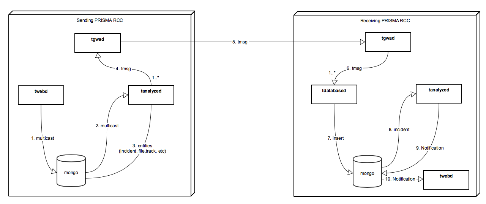

# Incident

## State


## Transfer


**twebd (1)** 
Incident log entry for ACTION_TRANSFER created.  One Multicast created.  One Transmission created.  Local Incident State is Closed.  Remote Incident State is Transferring. 

**tanalyzed (2,3)**
Transmission Packets created.  One-to-many TsiMessage sent.  Transmission State and Status updated.

**tgwad (4,5,6)**
TsiMessage sent.  DeliveryReport sent.

**tdatabased (7)**
TsiMessage processed.  Incident and File inserted.  Incident log entry for ACTION_TRANSFER updated.

**tanalyzed (8,9,10)**
Incident processed.  IncidentId is created.  Incident log entry for ACTION_TRANSFER updated.  Incident unassigned.  Incident State is Open.  Notification sent.  DeliveryReport processed sent.

## Incident Transfer Setup 

### tgwad configuration: 

Tgwad should be configured in /etc/trident/tmsd.conf with a unique site number and name, and should have information about tgwads running in remote sites as below:

```bash 
tgwad --num <site_number> --name <site_name> 
-site <remote_site_name>,<remote_site_number>tcp:<remote_site_ip>:<remote_tgwad_port>
```
Example:
```bash 
tgwad --num 1 --name Iquique -site Puerto,2,tcp:110.0.0.11:31228 -site Madrid,3,tcp:110.0.0.12:31228
```
### site information insertion

There are many ways for inserting a new site into sites collection, the following is how you can do it with a js script and mongo as interactive JavaScript shell interface to MongoDB.

1- Modify site.js script to contain correct information you need about the site you want to insert. See example: 
```js
db = connect("localhost:27017/trident");
print(db.sites.insert({ "id" : ObjectId(), "siteid" : 201, "type" : "RCC", "name" : "Casablanca", "description" : "McMurdo PRISMA test Demo Server.", "address" : "", "country" : "Morocco", "point" : { "latitude" : 39, "longitude" : -76, "altitude" : 0 }, "connectionstatus" : 0, "parentid" : "", "incidentidprefix" : "CASA", "devices" : [ ], "capability" : { "inputincident" : true, "outputincident" : true } }));
```
2- Run the script using mongo on the server hosting your database
```bash
mongo site.js
```
3- Look at the output of the script to verify if the insert was sucessful: 
    * Success: 
            ```bash
            MongoDB shell version v3.6.8
            connecting to: mongodb://127.0.0.1:27017
            MongoDB server version: 3.6.8
            connecting to: mongodb://localhost:27017/trident
            MongoDB server version: 3.6.8
            WriteResult({ "nInserted" : 1 })
            ```
    * Failure:
            ```bash
            MongoDB shell version v3.6.8
            connecting to: mongodb://127.0.0.1:27017
            MongoDB server version: 3.6.8
            connecting to: mongodb://localhost:27017/trident
            MongoDB server version: 3.6.8
            WriteResult({
                "nInserted" : 0,
                "writeError" : {
                    "code" : 11000,
                    "errmsg" : "E11000 duplicate key error collection: trident.sites index: siteIdUnique dup key: { : 205.0 }"
                }
            })
            ```
### Local Site Configuration

The local site configuration is saved in trident db inside the config collection. Config collection contains a Site object that holds information about the local site. It's very important to assign a value to "incidentidprefix" field to avoid incident Id collisions when tansfering an incident.
```json
{
"site" : {
        "id" : "",
        "siteid" : 201,
        "type" : "RCC",
        "name" : "Casablanca",
        "description" : "Site description",
        "address" : "123",
        "country" : "Morocco",
        "point" : null,
        "connectionstatus" : 0,
        "parentid" : "",
        "incidentidprefix" : "CASA",
        "devices" : [],
        "capability" : {
            "inputincident" : true,
            "outputincident" : true
        }
    }
}
```
In case "incidentprefix" field is empty then you can run the below js script using mongo to update the field: 

```js 
db = connect("localhost:27017/trident");
print(db.config.update({},{$set:{"site.incidentidprefix" : "RBT"}}));
```

    !!! warning "sudo systemctl restart tms.service"
        Once all the above vconfiguration steps are done restart tms.service, so the backend can load all the config changes

## Transmission lifecycle


###### Diagram source
https://team.technosci.com:8443/wiki/display/CONV/Incident+Transfer
