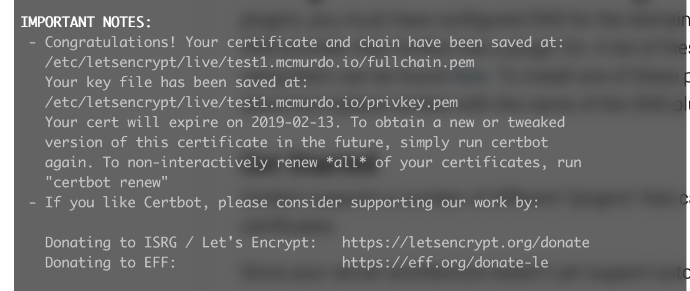

# SSL KEYS

PRISMA C2 uses SSL for all communications from the Client to the Server. Every system must have a valid SSL certificate.

For most installed systems, we recommend that the client provides valid trusted SSL certificates for each of their server application installations. We can generated custom SSL certificates locally using `telfsign` but this is not recommended since the certificates will be untrusted by a Certificate Authority.

## Configuration the application to use SSL with the backend
### To enable secure server connections (server listening to HTTPS/WSS):

1. On development and demo machines - create a self-signed certficate and store it on the vagrant VM.
2. On production and client-facing demo machines - it is recommended that we get a certificate signed by a Certificate Authority.

Modify the `/etc/trident/tmsd.conf` file to add the path to the server certificate (-certfile), server key (-keyfile)
options to twebd configuration:

```
...
{twebd -certfile /vagrant/cert/server.crt -keyfile /vagrant/cert/server.key }
...
```

Both -certfile and -keyfile options must be provided, if only one option is provided, the server will not switch over to
SSL/TLS.

### To disable secure server connections (Server listening to HTTP/WS):

Remove the -certfile and  -keyfile options from the twebd configuration in `/etc/trident/tmsd.conf`.

## Certbot

Generates a valid signed certificate that is good for 90 days. Certbot installs a cron job to automatically renew every 90 days so you shouldn't have to manage the certs once installed.

For new AWS servers, you should take advantage of these keys since they don't require installation on the client. You will need to run this on each machine to generate keys, and ensure the cronjob is installed.

Follow the install instructions in the [Certbot docs](https://certbot.eff.org/lets-encrypt/ubuntuxenial-other) then run:

```
 sudo certbot certonly
```

For the questions, I provided the following answers to create the certs:

1. Select 1 for spin up a temporary web server.
2. Email: john.conway@orolia.com
3. A for Agree to the terms.
4. Y or N to send your email to the EFF
5. Domain of the server you are currently on, eg. `test1.mcmurdo.io`

If asked:

1. Organization: Orolia, Inc
2. State: Maryland
3. City: Lanham

This will generate the fullchain and privkey pem files in `/etc/letsencrypt/live/<domain>/` which are a symbolic link to `/etc/letsencrypt/archive/<domain>`.

With the certs created, we need to setup the tmsd.conf as described above to point to the two files, and we also need to let the prisma user access the keys since twebd and tauthd are run as prisma and need to be able to read those keys.

```
sudo chown -R root:prisma /etc/letsencrypt/live
sudo chown -R root:prisma /etc/letsencrypt/archive
sudo chmod g+rx /etc/letsencrypt/live
sudo chmod g+rx /etc/letsencrypt/live/<domain>/
sudo chmod g+rx /etc/letsencrypt/archive
sudo chmod g+rx /etc/letsencrypt/archive/<domain>/
```

Example `tmsd.conf` for certificates:

```
```



## tselfsign

We provide a helper utility called `tselfsign` to generate SSL certificates. This is only recommended for development or test machines. For production or demo machines, we recommended getting a signed certificate from a Certificate Authority.

`tselfsign` can be used to create custom SSL Certificates for client/server communication encryption
as well as x509 certificates and keys for mongo authentication and encryption.

### Generating custom SSL certificate for Client/Server Encryption

TODO: document how to use `tselfsign` to generate client/server SSL certificates.

#### Installing the certificate on the client machine

##### Windows

##### macOS

##### Linux

## Configure the backend to use SSL with MongoDB

MongoDB supports x.509 certificate authentication for use with a secure TLS/SSL connection. The x.509 client authentication allows clients to authenticate to servers with certificates rather than with a username and password. The following tutorial outlines the steps to use x.509 for client authentication. This can be done using `tselfsign` or openssl directly. Steps will be provided for both.

!!! IMPORTANT "Prerequisites"
    A full description of TLS/SSL, PKI (Public Key Infrastructure) certificates, in particular x.509 certificates, and Certificate Authority is beyond the scope of this document. This tutorial assumes prior knowledge of TLS/SSL as well as access to valid x.509 certificates.

### Certificate Authority

For production use, your MongoDB deployment should use valid certificates generated and signed by a single certificate authority. You or your organization can generate and maintain an independent certificate authority, or use certificates generated by a third-party TLS/SSL vendor. Obtaining and managing certificates is beyond the scope of this documentation.

In the steps below, we will outline creating a CA for self signed certificates, but it is highly recommended you use an existing CA for production environments.

!!! INFO
    If the --sslCAFile option and its target file are not specified, x.509 client and member authentication will not function. mongod, and mongos in sharded systems, will not be able to verify the certificates of processes connecting to it against the trusted certificate authority (CA) that issued them, breaking the certificate chain. As of version 2.6.4, mongod will not start with x.509 authentication enabled if the CA file is not specified.

### Client x.509 Certificate

The client certificate must have the following properties:

- A single Certificate Authority (CA) must issue the certificates for both the client and the server.
- Client certificates must contain the following fields:

    ```bash
    keyUsage = digitalSignature
    extendedKeyUsage = clientAuth
    ```
- Each unique MongoDB user must have a unique certificate.
- A client x.509 certificate’s subject, which contains the Distinguished Name (DN), must differ from that of a Member x.509 Certificate. Specifically, the subjects must differ with regards to at least one of the following attributes: Organization (O), the Organizational Unit (OU) or the Domain Component (DC).

!!! info
    If a client x.509 certificate’s subject has the same O, OU, and DC combination as the Member x.509 Certificate, the client will be identified as a cluster member and granted full permission on the system.

### Generating mongo certificates

#### Generate self-signed SSL certs and public key

First we need to generate the mongo CA and then generate the certificates for each mongo instance you will be configuring. For replicated mongo instances, you need a since CA certificate and a set of instance certificates for each mongo instance. For non-replicated you only need a single instance certificate.

##### Generate a Certificate Authority key and certificate

On your primary server run this command to generate the certificate authority private key and certificate.

```tselfsign tab=
tselfsign  --generateCA --ip <server-ip>
```

```openssl tab=
cd /etc/trident
sudo openssl genrsa -out mongoCA.key -aes256 8192
sudo openssl req -x509 -new -extensions v3_ca -key mongoCA.key -days 365 -out mongoCA.crt
```

!!! important When using openssl
    You will be asked for a passphrase. You can leave this empty or create a secure passphrase for an additional level of security. You will also be asked for some information, generally a company name, address, and website will be fine and everything else can be left as default.

This command will generate 3 files under /etc/trident as shown below:

```bash
mongoCA.crt    mongoCA.key    mongoCA.srl
```

For replicated systems, copy mongoCA.crt and mongoCA.key to all the other nodes and place the in the `/etc/trident` directory.

!!! note
    You can also generate the instance certificates for the primary server at the same time by just adding the `--generateMongoCertificate` command to `tselfsign`, otherwise, use the next section to generate the primary instance certificates.


##### Generate a Certificate for each Mongo Instance

Now, you must log onto each system with a mongo instance and run the following to generate instance certificates from the mongoCA.key and mongoCA.crt that you copied in the previous section into `/etc/trident`. If you do not have those two files in `/etc/trident` then this step will not work.

```tselfsign tab=
tselfsign  --generateMongoCertificate -ip <server-ip>
```

```openssl tab=
cd /etc/trident
sudo su
export HOST_NAME="<HOSTNAME>"
export SUBJECT="/O=Orolia/OU=trident/CN=$HOST_NAME"
openssl req -new -nodes -newkey rsa:4096 -subj "$SUBJECT" -keyout mongo.key -out mongo.csr
openssl x509 -CA mongoCA.crt -CAkey mongoCA.key -CAcreateserial -req -days 365 -in mongo.csr -out mongo.crt
rm mongo.csr
sudo cat mongo.key mongo.crt > mongo.pem
```

the below files will be generated under /etc/trident.

```bash
mongo.crt      mongo.key      mongo.pem
```

!!! note
    Using tselfsign is relatively simple compared to using openssl, for more information on how to use tselfsign check its usage [here](../linked-documents/tms/cmd/daemons/tselfsign/README.md).

If you need to trust the certificates then run the below command:

```bash
sudo cp /etc/trident/mongo.crt /usr/local/share/ca-certificates/
sudo update-ca-certificates
```

#### Create mongo Authorized User

To authenticate with a client certificate, you must first add the value of the subject from the client certificate as a MongoDB user to the $external database. Each unique x.509 client certificate corresponds to a single MongoDB user; i.e. you cannot use a single client certificate to authenticate more than one MongoDB user.

When you are using replica sets, you will need to only add the user once to the PRIMARY instance in a mongo replica set.

First, get the client certificate subject. You can retrieve the RFC2253 formatted subject from the client certificate with the following command:

```bash
(cd /etc/trident ; openssl x509 -in mongo.pem  -inform PEM -subject -nameopt RFC2253)
```

The command returns the subject string as well as certificate:

```bash
subject= CN=myName,OU=myOrgUnit,O=myOrg,L=myLocality,ST=myState,C=myCountry
-----BEGIN CERTIFICATE-----
# ...
-----END CERTIFICATE-----
```

Add the RFC2253 compliant value of the subject as a user. Omit spaces as needed.
For example, the following adds a user and grants the user readWrite role in the test database and the userAdminAnyDatabase role:

```js
db.getSiblingDB("$external").runCommand(
  {
    createUser: "CN=112.0.0.10,OU=trident,O=Orolia,L=Ln,ST=MD,C=US",
    roles: [
         { role: "userAdminAnyDatabase", db: "admin" }
    ],
    writeConcern: { w: "majority" , wtimeout: 5000 }
  }
)
```

See [Manage Users and Roles](https://docs.mongodb.com/manual/tutorial/manage-users-and-roles/) for details on adding a user with roles in Mongodb.

#### Configure mongo for Authentication and Security

Mongod configuration file needs to enable ssl and reference CA file and PEM key file. Open `/etc/mongod.conf` and for the net and security sections make sure they look similar to the following.

```yaml
net:
  ssl:
     mode: preferSSL
     PEMKeyFile: /etc/trident/mongo.pem
     CAFile: /etc/trident/mongoCA.crt
  bindIpAll: true
  port: 27017

security:
    authorization: enabled
    clusterAuthMode: x509
```

After change mongod.conf restart mongod as below:

```bash
sudo systemctl restart mongod
```

Make sure that mongod restarted properly:

```bash
sudo systemctl status mongod
```

#### Update tmsd.conf

You will need to update the `tmsd.conf` file to ensure `twebd`, `tauthd`, `tdatabased`, and `tanalyzed` have the flags for `--sslCAFile`, `--sslCertFile`, `--sslKeyfile`, and `--mongo-url`.

```bash
{tdatabased --sslCAFile /etc/trident/mongoCA.crt --sslCertFile /etc/trident/mongo.crt --sslKeyfile /etc/trident/mongo.key --mongo-url mongodb://host-ip:27017ssl=true}
{tanalyzed --sslCAFile /etc/trident/mongoCA.crt --sslCertFile /etc/trident/mongo.crt --sslKeyfile /etc/trident/mongo.key --mongo-url mongodb://host-ip:27017ssl=true}
{tauthd --sslCAFile /etc/trident/mongoCA.crt --sslCertFile /etc/trident/mongo.crt --sslKeyfile /etc/trident/mongo.key --mongo-url mongodb://host-ip:27017ssl=true}
{twebd --sslCAFile /etc/trident/mongoCA.crt --sslCertFile /etc/trident/mongo.crt --sslKeyfile /etc/trident/mongo.key --mongo-url mongodb://host-ip:27017ssl=true}
```

#### Test the setup

To connect to mongo shell, you can use `mongo` command directory or the new `tmongo-cli` to avoid having to pass the key files to `mongo` when you are using the default CA and pem file locations:

```tmongo-cli tab=
tmongo-cli <HOST IP>
```

```mongo tab=
mongo --ssl --sslPEMKeyFile /etc/tridet/mongo.pem  --sslCAFile /etc/trident/mongoCA.crt --authenticationDatabase '$external' --authenticationMechanism MONGODB-X509 --host host-ip
```

If you are running replication, you can test that the nodes are connected by running the below command in the secondary mongo shell:

```js
rs.printSlaveReplicationInfo()
```

If you see something similar to the following, we know everything is running smoothly:

```bash
source: 113.0.0.12:27017
	syncedTo: Mon Feb 04 2019 16:15:42 GMT+0000 (UTC)
	0 secs (0 hrs) behind the primary
```

To test is tms daemons are able to connect to the db you can run tdatabased from the terminal as below:

```bash
tdatabased -stdlog -log debug --sslCAFile /etc/trident/mongoCA.crt --sslCertFile /etc/trident/mongo.crt --sslKeyfile /etc/trident/mongo.key --mongo-url mongodb://host-ip:27017ssl=true
```

The output would look like this is you have data collection daemons sending data to tdatabased:

```bash
DEBUG: 2019-02-04 16:24:56.933627709 +0000 UTC m=+1.670831397 (db/mongo/client.go:89) Not authorized: <*>(0xc425717f20)not authorized on admin to execute command { listDatabases: 1, $db: "admin" }
DEBUG: 2019-02-04 16:24:56.934280804 +0000 UTC m=+1.671484506 (db/mongo/client.go:92) Authenticating...
DEBUG: 2019-02-04 16:24:56.935776465 +0000 UTC m=+1.672980128 (db/mongo/client.go:97) logged to [aaa admin config local trident]
DEBUG: 2019-02-04 16:25:00.690826405 +0000 UTC m=+5.428030076 (db/inserter.go:406) Inserts: 138 total, 27.59741574487275/s, 0 errors
```
